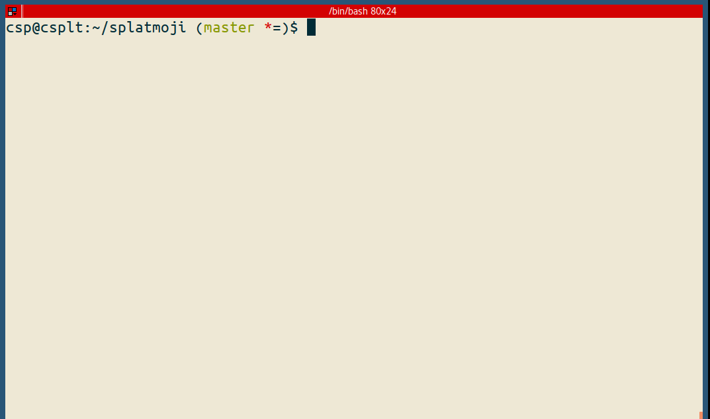

Splatmoji
=========

Quickly look up and input emoji and/or emoticons/kaomoji on your GNU/Linux desktop via pop-up menu.

(ノ・∀・)ノ 😃



Splatmoji supports skin tone filtering, custom data sets, and includes emoji annotations in all languages supported by Unicode [CLDR].

# Install

Requirements:

* Bash
* [rofi]
* xdotool (for typing your selection in for you)
* xsel (for putting your selection into the clipboard) (xclipboard also works)
* jq (if JSON escaping is called for with the argument `--escape json`)

```sh
# sudo apt-get install rofi xdotool xsel || sudo yum install rofi xdotool xsel
git clone https://github.com/cspeterson/splatmoji.git
```

# Usage

```sh
# Call with default emoji and emoticon data files, copy result to clipboard
./splatmoji copy

# Call with default emoji and emoticon data files, type out result
./splatmoji type

# Call with a specific custom data file, copy result to clipboard
./splatmoji copy /path/to/data/file1 /path/to/data/file2
```

You probably would want to bind this to some key combination in your window manager/desktop enviroment.

### i3wm

[i3wm] is my preferred window manager.

```sh
# This would go into your .config/i3/config to bind to Super+slash
bindsym $mod+slash exec "/path/to/the/script type"
```

### Gnome

[This Gnome.org help page] seems to outline how to do this in the popular Gnome desktop environment.

# Configuration

Configuration options can be changed in `<project_dir>splatmoji.config` or by overriding the in-project config file with `${HOME}/.config/splatmoji/splatmoji.config` (recommended).

Example config:

```ini
# These are the 3 commands you will need for everything to work
# you can modify these commands as shown below in the respective subsections
xsel_command=xsel
xdotool_command=xdotool type
rofi_command=rofi -dmenu -p : -i -monitor -2
```

## Xsel config (copying to clipboard)

You can alter the arguments sent to xsel to change, say, which "selection" your text goes into. By default it will go to the "CLIPBOARD" selection, which is the one you would usually get when doing Ctrl+c/v.

For further options, check the xsel manpage.

```ini
# You can also use xclipboard, or (likely) any other clipping tool that you can pipe an echo into to cause selection
# xclipboard example
xsel_command=xclip -selection clipboard
```

## Xdotool config (auto-typing)

You can alter the arguments send to xdotool for typing out your selection.

For options, check the xdotool manpage.
```ini
# Example from above
xdotool_command=xdotool type
```

Ultimately, though, recognize that this tool's `type` mode relies on xdotool and it can be finnicky on any particular setup, either generally or when typing into particular applications. Tooling around with `--delay` is usually going to be a good start to fixing that. Just don't forget, there's always the rock-solid `copy` mode instead.

## Rofi config (the pop-up menu)

Examples:

```ini
# These default arguments will pop up the menu over the currently active window
rofi_command=rofi -dmenu -p : -i -monitor -2
# Alternatively, it could pop up in the middle of the current monitor with the prompt 'Search:'
rofi_command=rofi -dmenu -p 'Search:' -i -monitor -1
# Or you could specify a theme
rofi_command=rofi -dmenu -p : -i -monitor -2 -theme /path/to/themefile
```

For *many* other options, see the rofi manpage.

# Updating emoji/emoticons

## Emoji

I started a separate project ([Splatmoji-emojidata]) dedicated to maintaining an organized, absolutely complete, and up-to-date set of emoji. It is from there that this project gets its emoji database. There shouldn't be much to update as I'll be in sync with the latest CLDR releases from Unicode, but [the repo itself][Splatmoji-emojidata] has intructions and scripts for updating directly from the source.

# Emoticons

I'm planning on creating/maintaining a comprehensive database, and would love it if someone could point me to a well-labeled database.

But in the mean time, just make sure you're up to date by pulling from this very repo:

```sh
cd <install dir>
git pull
```

You can also update the emoji/emoticon sets from the same source manually if you find that this repo is not keeping up fast enough for you:

```sh
# How to pull the sets from the remote files and transform to tsv (requires jq)
curl 'https://raw.githubusercontent.com/w33ble/emoticon-data/master/emoticons.json' | importers/w33ble2tsv - > data/emoticons.tsv
```

# Custom Configuration and Custom Emoji/Emoticons

This repo uses emoji from [Splatmoji-emojidata] and emoticons.json from [w33ble/emoticon-data], but you can use your own files either additionally or as a replacement.

The emoji/emoticons should be stored in tsv like so:
```
emoji<tab>name<tab>keywords etc
```

And then you can call the utlity with your preferred data files as per [Usage](#usage) above.

Please let me know what better source you wind up using, and maybe the command(s) you use to convert it into the above format, and I'll probably work it into the repo. 🙂

# FAQ

* Why do some of the emoji come out as multiple characters?
  - These are called ZWJ (zero-width joiner) Sequences. Some combinations of multiple different emoji can be combined in sequence with a special zero-width character as a joiner, and if the platform and application supports it a single meaningful symbol will be displayed. On platforms or applications that *don't* support it though, no worries; it just displays the seperate emoji in sequence. 🙂
* Why are my emoticons missing characters when using `type` mode?
  - Solving this will be between you and how you tune the [Xdotool config](#xdotool-config-auto-typing). A great place to start is with the `--delay` parameter. If you wind up doing anything clever to solve your problem, let me know and we'll see if we can work it back into this repo! 🙂

# Contributing

Taking pull requests [here].

# Credits

By [Christopher Peterson] ([@cspete])

# License

The MIT License (MIT). Please see [LICENSE](LICENSE) for more information.

[@cspete]: https://www.twitter.com/cspete
[BCP47]: http://www.iana.org/assignments/language-subtag-registry/language-subtag-registry
[CLDR]: http://cldr.unicode.org/
[Christopher Peterson]: https://chrispeterson.info
[Rofi manpage]: https://github.com/DaveDavenport/rofi/wiki/rofi-manpage
[Splatmoji-emojidata]: https://github.com/cspeterson/splatmoji-emojidata
[This Gnome.org help page]: https://help.gnome.org/users/gnome-help/stable/keyboard-shortcuts-set.html.en
[here]: https://github.com/cspeterson/splatmoji.git
[i3wm]: https://i3wm.org/
[rofi]: https://github.com/DaveDavenport/rofi
[w33ble/emoticon-data]: https://github.com/w33ble/emoticon-data
